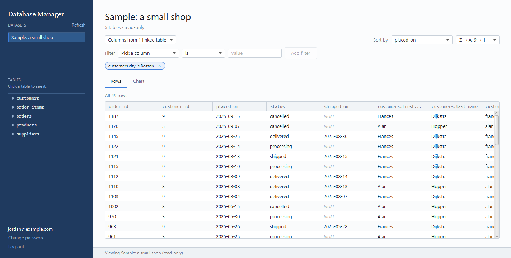
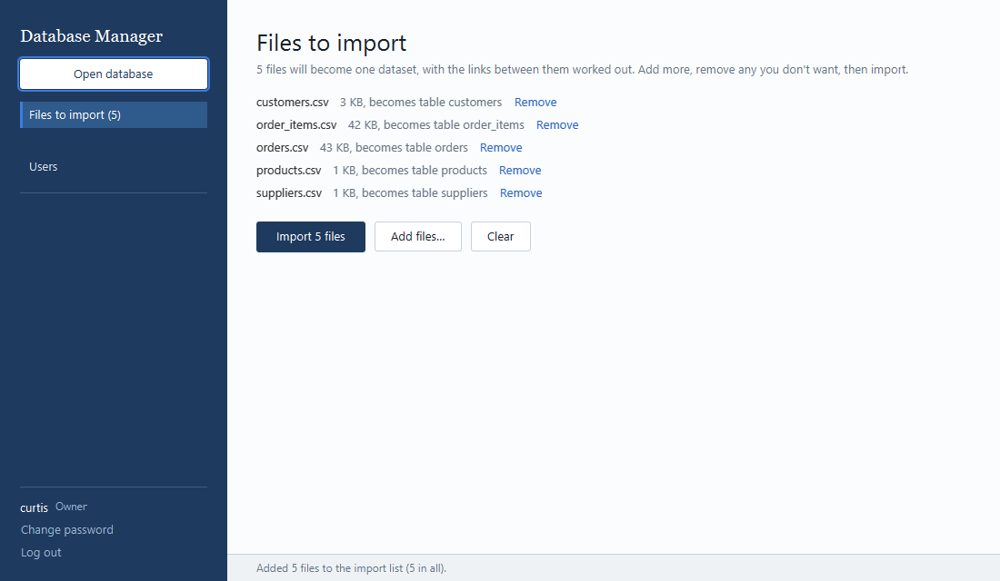
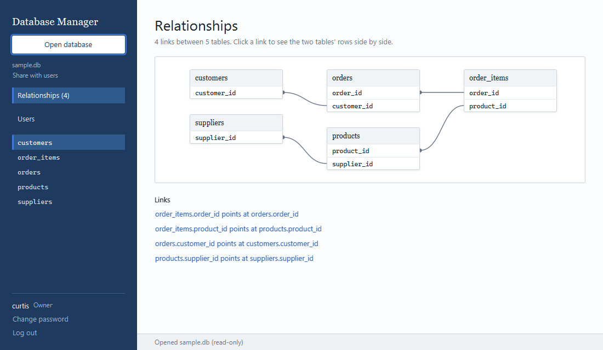
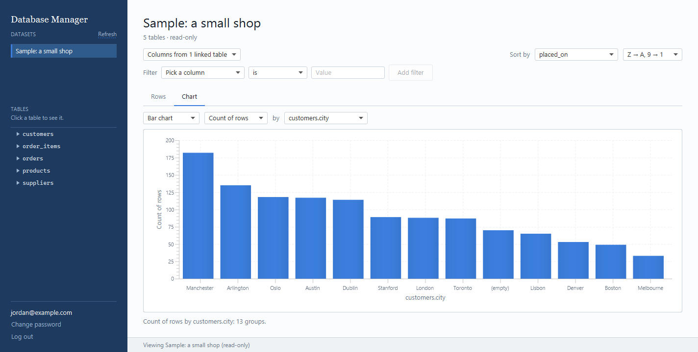
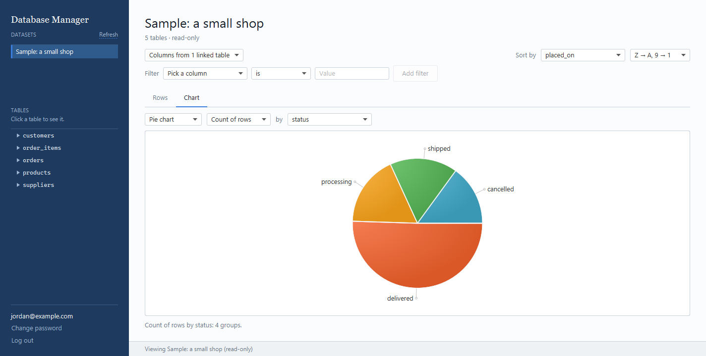
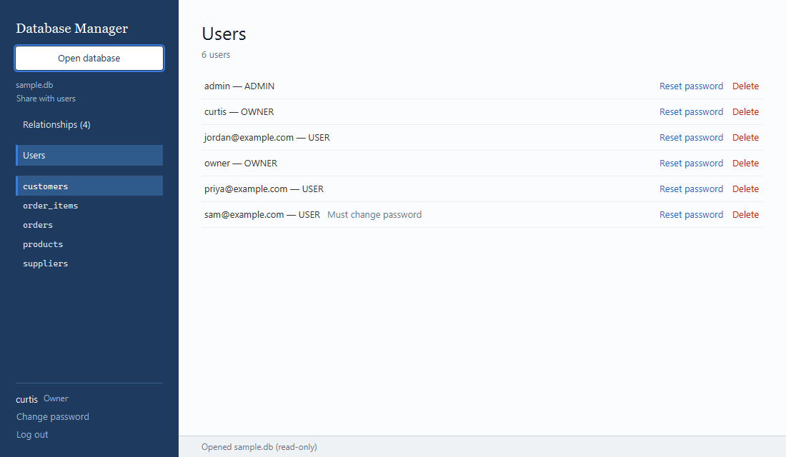
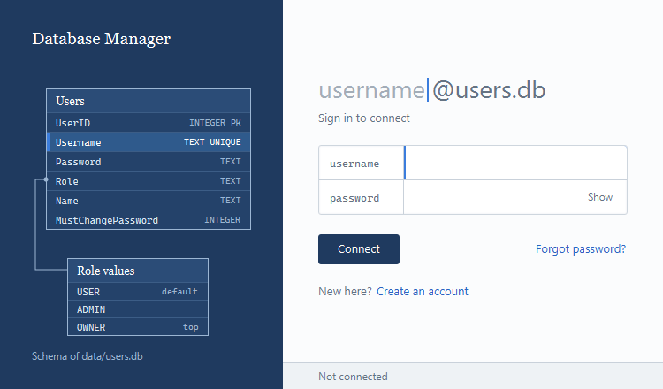
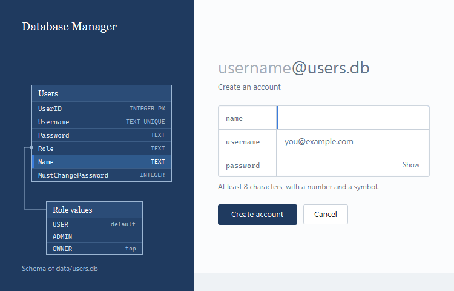

# HelloApplication

A native JavaFX desktop Database Manager for data events like DataFest:
admins drag and drop CSV or JSON files to turn them into datasets, and users
explore and chart them by pointing and clicking, with no SQL needed. SQLite-backed
login/registration with a USER / ADMIN / OWNER role hierarchy.



## Highlights

- **Imports CSV and JSON of any size.** CSV is streamed, so an 8-million-row file imports
  in a few minutes without running out of memory.
- **Finds the links between files by itself.** Columns like `orders.customer_id` are matched
  to `customers.id`, saved as real foreign keys, and drawn as a diagram.
- **No SQL needed.** Users point and click to filter, link tables and chart read-only datasets;
  `QueryBuilder` writes the SELECT behind the scenes, computed by SQLite over the whole result.
- **Real accounts.** Argon2id password hashing, a password policy, forced first-login password
  change, and a USER / ADMIN / OWNER role hierarchy.
- **Tested.** JUnit 5 tests cover the importers, relationship finder, link editor, query builder
  and user management.
- Built in Java 21 and JavaFX 21 (no FXML) on SQLite.

## Screenshots

**Drop in CSV or JSON files and import them as one dataset (admin)**



**How the tables link, drawn as a diagram (admin)**



**Charts from any table: bar, line, pie or scatter**





**Manage accounts: reset passwords and delete users, guarded by role (admin)**



**Sign in, or create an account**





## What it does

At a data event, organizers hand out raw data files and participants
need to explore them quickly. HelloApplication gives everyone one place to
do that:

1. **Sign in.** Everyone logs in with their own account; new
   participants can create one from the login screen. Passwords are
   hashed, and the seeded admin accounts must pick a new password the first
   time they log in.
2. **Admins bring the data in.** An admin drops CSV, TSV, JSON or JSON Lines
   files onto the Database Manager. The app turns them into tables in a new
   SQLite database. It also works out how the files link together (for
   example, `orders.customer_id` → `customers.id`), saves those links as
   foreign keys, and draws them as a diagram. That database becomes a dataset
   every user can see. CSV files can be any size (an 8-million-row file
   imports in a few minutes); JSON files are limited to 200 MB.
3. **Users explore it, without knowing SQL.** A participant picks a
   dataset and a table, pulls in columns from linked tables, adds filters
   and a sort, and turns the result into bar, line, pie or scatter charts,
   all by pointing and clicking. The app writes the SQL behind the scenes.
   Datasets are opened read-only, so nobody can change or break the shared
   data.

A built-in sample shop database is always available to practise on, even
before any data has been imported.

## Stack

- Java 21, JavaFX 21 (no FXML — views are built in code)
- SQLite (`sqlite-jdbc`) for accounts and for every imported dataset
- JavaFX charts (`javafx.scene.chart`, part of `javafx-controls`) for Home's charts
- Argon2id password hashing via BouncyCastle (`bcprov-jdk18on`)
- JUnit 5 for tests

## Requirements

- **JDK 21 or newer** on your PATH (`maven-compiler-plugin` targets release 21).
- **No separate Maven install needed** — `mvnw` / `mvnw.cmd` download the
  correct Maven version automatically.
- **No separate JavaFX SDK download needed** — `javafx-controls` and the
  `javafx-maven-plugin` pull the JavaFX runtime in as regular Maven
  dependencies.
- **Internet access on first build**, to fetch dependencies from Maven
  Central: `javafx-controls`, `sqlite-jdbc`, `bcprov-jdk18on`
  (BouncyCastle, pure Java — no native crypto library to install), and
  `junit-jupiter` (test scope only). CSV and JSON are parsed by the app's
  own readers, so there's no extra library for them.
- Windows, macOS, or Linux — `sqlite-jdbc` bundles the correct native
  SQLite binary for your platform automatically.

## Running

```
./mvnw clean javafx:run
```

Launches `MainApp` (via `Launcher`), which opens `Login_View`. On first run, `Database.init()` creates
`data/users.db` and seeds two accounts, both flagged to require a new password on first login:

| Username | Password  | Role  |
|----------|-----------|-------|
| `admin`  | `secret`  | ADMIN |
| `owner`  | `changeme`| OWNER |

Logging in with either routes straight to `ChangePassword_View` (forced —
no Cancel) before anywhere else. After that, login opens `Admin_View`
(ADMIN/OWNER) or `Home_View` (USER). The signed-in account (a `Roles`
object) is carried into every post-login screen, so each one knows who is
using it without asking the database again. Both screens show that account
in their side panel — username, plus "Admin" or "Owner" for admins — with
"Change password" and "Log out" links.

**Admin_View: the Database Manager, where data comes in.** Drop CSV, TSV,
JSON or JSON Lines files anywhere on the window (or use Open database →
Import CSV or JSON files) to add them to the import list, where files can be
added a few at a time, removed, or cleared. Import then turns the list into a
new SQLite database under
`data/imports/`, named after its tables (`orders-payments.db`), with the
links between the files worked out and saved as foreign keys. That database
is now a *dataset*: every user sees it on their Home screen. The
Relationships view draws how the tables connect, and clicking a link shows
the two tables joined along it. When two columns belong together but are named
differently (`orders.cust_no` and `customers.customer_id`), "Add link…" there
lets an admin pick them from lists and save the link, after checking how many
values match. Admins can also open the sample or any SQLite
file, "Share with users" to copy an opened database into `data/imports/`, and
"Remove from datasets" to delete one (after a confirmation).

The side panel's **Users** button opens a list of every account (username,
role, and whether they still must change their password), with "Reset
password" and "Delete" links per row, each behind a confirmation dialog.
Resetting sets a random temporary password (shown once, in a dedicated
dialog) and flags the account to change it at next login — this is what
"Forgot password?" on the login screen now points people to. Both actions
are role-guarded: see Roles below for what an ADMIN or OWNER can and can't
do to another account.

JSON files become tables like this: an array of objects is one table named
after the file; an object holding several arrays of objects
(`{"customers": [...], "orders": [...]}`) is one table per array; nested
objects become columns (`card.brand` → `card_brand`), and nested arrays are
kept as JSON text.

**Home_View: point-and-click exploring and charts, read-only, no SQL.** Pick
a dataset on the left (the built-in sample shop is always there to practise
on), then click a table to see it. **Add columns from…** pulls in columns
from linked tables (for `orders`, the customer's city and email), using the
links the importer found. **Filter** adds conditions like "customers.city is
Boston" as removable chips, and **Sort by** orders the rows. The Chart tab
turns the result into a bar, line, pie or scatter chart: pick what to group
by and what to measure (count of rows, or the sum, average, minimum or
maximum of a number column). Charts are computed by SQLite over the whole
result, not just the 500 rows shown. `QueryBuilder` writes the SQL behind
every click, so users never see or type any. Datasets are opened read-only,
so nothing a user does can change the data.

Even with the forced first-login change, treat these as fixed seed
values and rotate them again before any real deployment.

## Roles

- `USER` — created via the "Create an account" flow on the login screen.
- `ADMIN` — opens the Database Manager; can delete `USER`/`ADMIN` accounts.
- `OWNER` — top-tier account. `UserManagement` blocks an `ADMIN` from
  deleting an `OWNER` account; only another `OWNER` can.

Two guards apply regardless of role: nobody can delete their own account,
and an `OWNER` can't delete the last remaining `OWNER`. Both leave a live
session with no row behind it, so `UserManagement.deleteUser` rejects them
before touching the database.

Account management lives in `UserManagement` (`listUsers()`,
`deleteUser(actor, username)` and `resetPassword(actor, username)`),
surfaced in `Admin_View`'s Users panel.

## Testing

```
./mvnw test
```

## Project layout

- `Launcher` / `MainApp` — the one JavaFX entry point (`Application.launch`). Every screen below is a
  plain class with a `show(Stage)` method that reuses the same `Stage` instead of opening its own.
- `Login_View` / `LoginController` / `Authenticator` — login flow
- `Create_View` / `CreateAccountController` / `Registration` — account creation
- `ChangePassword_View` / `ChangePasswordController` / `PasswordChange` — forced (seeded accounts'
  first login) and self-service password changes
- `Admin_View` — the Database Manager (ADMIN/OWNER): import files into datasets, browse tables and
  relationships, share or remove datasets, and manage accounts in the Users panel
- `Home_View` — point-and-click exploring and charts over the datasets (USER)
- `QueryBuilder` — turns Home's choices (linked tables, filters, sort) into the SELECT behind them
- `Datasets` — the list of datasets in `data/imports/` that Home offers, with readable names
- `DatabaseBrowser` — read-only access to a SQLite file: tables, columns, capped row preview,
  foreign keys, joins, and a checked, read-only runner for the SELECT queries `QueryBuilder` writes
- `ChartMaker` — the SQL behind each chart (grouped by SQLite over the whole result) and the JavaFX chart
- `SampleDatabase` — builds the generic sample shop database at `data/sample.db` on first use
- `CsvReader` / `JsonReader` / `StagedTable` / `RelationshipFinder` / `DataImporter` — import: stream CSV
  (or read JSON) files into scratch tables, work out which columns point at which keys (with a confidence)
  using SQLite, and write a new SQLite database with those links as foreign keys
- `RelationshipDiagram` — the table-and-link drawing in Admin's Relationships view
- `LinkEditor` — links an admin adds by hand: checks how well two columns' values match, then saves the
  link as a foreign key by rebuilding the table
- `Views` — small helpers every screen repeats: stylesheets, show/hide, status bar, screen switching,
  role-based landing (`openLandingView`), and the signed-in account block
- `ViewText` / `BackgroundWork` / `ResultTable` — shared by both screens: status wording, database reads
  off the UI thread, and the dense results grid
- `Database` — SQLite schema, migrations, and account seeding
- `Roles` / `Role` — login result and role hierarchy (`USER` < `ADMIN` < `OWNER`); the `Roles` from
  login is the signed-in account handed to every post-login screen
- `UserManagement` — lists accounts (`UserSummary`: username, role, must-change-password), does
  role-guarded account deletion (blocking self-delete and deleting the last `OWNER`), and resets a
  password to a random temporary one, flagged to change at next login
- `Argon2PasswordHasher` / `PasswordPolicy` — password hashing and strength rules
- `PasswordVisibilityToggle` / `StatusLabelAlignment` — shared UI helpers: a Show/Hide toggle for
  password fields, and centered-unless-wrapped alignment for status messages
- `SchemaDiagram` — the Users-table drawing on the login screen's side panel
- `theme.css` (shared palette, side panel, buttons, links, status bar) plus `login.css` / `home.css`
  for each screen's own styling

See `documentation/Features.md` for what each feature does and how it works,
and `documentation/Coding Journal.MD` for the day-by-day build log.
